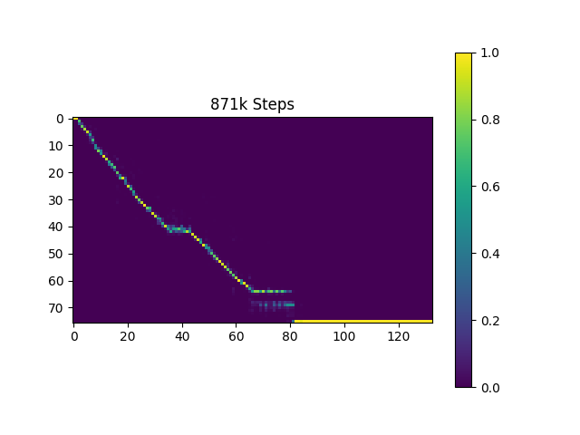
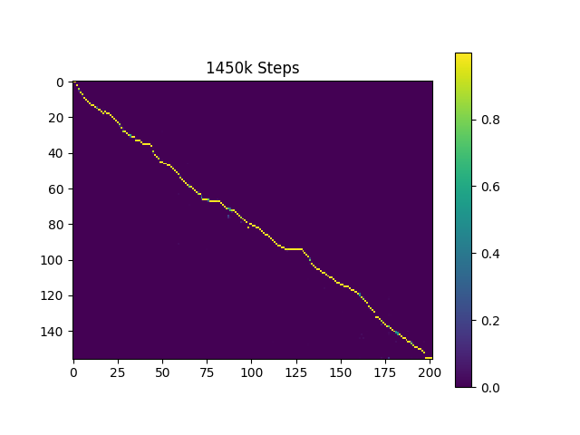

# Training

To create a synthetic voice you can use [our DC_TTS fork](https://github.com/bbc/dc_tts) of Kyubyong's wonderfull [implementation](https://github.com/Kyubyong/dc_tts) of [Efficiently Trainable Text-to-Speech System Based on Deep Convolutional Networks with Guided Attention](https://arxiv.org/abs/1710.08969).

---

There are two models that need to be trained:

1. **Text\_To\_Mel:** The Text\_To\_Mel model is a Deep Convolutional Neural Network that, given a sequence of characters as input, it will generate a coarse Mel Spectrogram. 

2. **Super-Resolution Network (SSRN):** This network will convert a coarse mel spectrogram into a full Short-Time Fourier Transform (STFT) spectrogram.

**These models can be trained independently**. So, you could train them in parallel, to save time, but on **two separate single-GPU machines**. Training them both on one dual-GPU machine hasn't been tested yet.

---

Instead of training from scratch, we are going to train on top of pretrained models, both for the Text\_To\_Mel and the SSRN networks. Specifically, we are going to train on top of the models trained on the 24 hour-long LJSpeech dataset. The advantage of this method is that we can reduce significantly the amount of training data required, and the time it takes to train the models. Specifically, we were able to create a decent synthetic voice with only about two and a half hours of training data and about 28 hours of training on GPU (however, a decent sounding voice was achieved in the first 8 hours of training).

# Cost and Resources

To train the Text\_To\_Mel network, a **p3.2xlarge** AWS **Spot** Instance was used, which costs about $1 per hour and features one **NVIDIA Tesla V100 GPU**. Even though the model was trained for 27h:54m in total, when I tested it **after 8 hours of training it sounded decent**. More research needs to be done to find the minimum amount of time required to train this network. This research should involve a method of evaluation.

The SSRN network usually requires less time. In this experiment it was trained for 5h:21m. A p3.2xlarge AWS **Spot** Instance was also used here.

| Network       | Hours | Iterations | Cost           |
|---------------|-------|------------|----------------|
| Text\_To\_Mel | 27.9  | 670k       | USD $27.9      |
| SSRN          | 5.35  | 49k        | USD $5.35      |
| **Total**     |       |            | **USD $33.25** |

# Setup

You can download a model that we trained on the [LJ Speech Dataset](https://keithito.com/LJ-Speech-Dataset/) from [here](https://www.dropbox.com/s/dum57sx8cmtugol/ljspeech_model_v1.2.tar.gz?dl=0).
This model is different than the one found in Kyubyong's repo as it has been trained using a different vocabulary (set of symbols) and it is compatible with the rest of our code.
[this line](https://github.com/bbc/dc_tts/blob/c96748dd9a651840e7a6633f9b6444d3938684f2/hyperparams.py#L43) configures the set of symbols that are used throught the system and it must be consistent with the characters found in the Dataset's metadata.csv file (as mentioned [here](../dataset/README.md)) and the trained model.

### SSRN Training

Training the SSRN model is more straight forward. You can simply stop the training process after 40k-50k iterations (5-6 hours). If you want to automate that, you can change the "num_iterations" parameters in the \~/dc_tts/hyperparams.py file on the remote instance, right after the deployment step.

### Text\_To\_Mel Training
It is advisable to monitor the progress of Text\_To\_Mel training, mainly so that you know when to stop training. Here are some ways to check the training progress:

#### 1. Check the Attention plot images
Attention Plots are an indicator of how well the model aligns text input to output frames. The closer to a diagonal it looks, the better.

This is how the Attention Plot looks like after 16k itterations:

This is the Attention Plot after 595k itterations:

**Note:** The reason why it reports "1450k Steps" in the screenshot (instead of 595k) is because the training started on an pre-trained model which was already trained for 855k iterations

#### 2. Trying out the model
You can of course try out the model as it is being trained, by downloading it and using it with the Synthesizer class. You can find out more about it in the [synthesis](../synthesis) section. Note that you should first have a trained SSRN model before you can start trying out the Text_To_Mel model, as both models are required by the Synthesizer.

